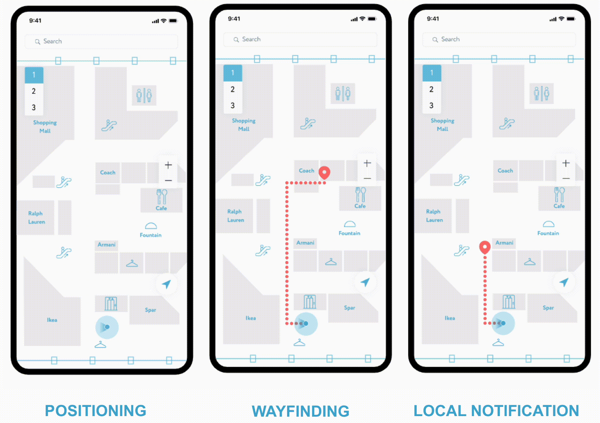

<a href="http://navigine.com"></a>

# iOS SDK 2.0

The following sections describe the contents of the Navigine iOS SDK repository. Files in our public repository for iOS are:

- Sources of the Navigine Demo Application for iOS
- Navigine SDK for iOS - header files and resources

### Useful Links

- [SDK Documentation](https://github.com/Navigine/Indoor-Navigation-iOS-Mobile-SDK-2.0/wiki) : Technical guides, API references, and integration instructions for the iOS SDK.
- [Navigine Official Docs](https://docs.navigine.com) : Complete list of downloads, product manuals, SDKs, and technical materials.
- [Start with Navigine](http://locations.navigine.com/login) : Create your account and gain full access to Navigation services, SDKs, CMS, and demo tools.
- [User Manual](http://docs.navigine.com/) : Step-by-step product usage and system setup instructions.
- [Contact Navigine](https://navigine.com/contacts/) : Reach our experts for technical or business inquiries.
- [Talk to an Expert](https://navigine.com/calendly-meet/) : Get personalized guidance from Navigine engineers on SDK setup, calibration, and deployment.
- [Community Thread for iOS SDK](https://community.navigine.com/t/indoor-navigation-ios-mobile-sdk-2-0/176) : Ask questions, share your implementation, or provide feedback directly in our developer discussion space

## iOS Demo Application

Navigine demo application for iOS enables you to test indoor navigation that you set up using Navigine CMS.
The NavigineDemo subfolder in this repository contains source files that you can use for compiling the Demo application.

To get the Navigine demo application for iOS, 

- Either find the [Navigine application in the Apple Store](https://itunes.apple.com/ru/app/navigine/id972099798) using your iOS device
- Or compile the application yourself [using source code, available at GitHub](https://github.com/Navigine/Indoor-Navigation-iOS-Mobile-SDK-2.0).

For complete guidelines on using the Demo, refer to the [corresponding sections in the Navigine User Manual](https://docs.navigine.com/en/Getting_Started), or refer to the Help file incorporated into the application.

Below, you can see some screenshots of the Demo representing locations list, defined location levels, navigation bar, and debug process.



## Navigation SDK and Implementation

Navigine SDK for iOS applications enables you to develop your own indoor navigation apps using the well-developed methods, classes, and functions created by the Navigine team.
The SDK file resides in the libs folder.

Find formal description of Navigine-SDK API including the list of classes and their public fields and methods at [Navigine SDK wiki](https://github.com/Navigine/Indoor-Navigation-iOS-Mobile-SDK-2.0/wiki).

## Installation with CocoaPods

[CocoaPods](http://cocoapods.org) is a dependency manager for Objective-C, which automates and simplifies the process of using 3rd-party libraries like Navigine in your projects. See the ["Getting Started" guide for more information](https://github.com/Navigine/Indoor-Navigation-iOS-Mobile-SDK-2.0/Getting-Started). You can install it with the following command:

```bash
$ gem install cocoapods
```

> CocoaPods 0.39.0+ is required to build Navigine 2.0.0+.

#### Podfile

To integrate Navigine into your Xcode project using CocoaPods, specify it in your `Podfile`:

```ruby
source 'https://github.com/CocoaPods/Specs.git'
platform :ios, '12.0'

target 'TargetName' do
pod 'Navigine'
end
```

Then, run the following command:

```bash
$ pod install
```

To start using Navigation library in your project you should do the following steps.
## Get started
##### Step 1
Register on https://locations.navigine.com, create a location and get your personal security key in the profile (it has the form 16 hexadecimal digits: `XXXX-XXXX-XXXX-XXXX`).

##### Step 2
Download [framework](../tree/main/Frameworks/) , unzip it and add it to the your project. 

##### Step 3
Set your user hash and server and get instance of Navigine SDK:

```Swift
// Set user hash and server before getting the instance of [[NavigineSdk|class-NavigineSdk]]

var mNavigineSdk: NCNavigineSdk?

mNavigineSdk = NCNavigineSdk.getInstance()
mNavigineSdk?.setServer(serverUrl) // your user hash from the server
mNavigineSdk?.setUserHash(userHash) // your server url (by default `https://ips.navigine.com`)
```

##### Step 4

Get instance of [[NCLocationManager|class-NCLocationManager]], set [[NCLocationListener|class-NCLocationListener]]and download a location archive from the server using the following (or similar) code:

```Swift
var mLocationManager = mNavigineSdk?.getLocationManager()
mLocationManager.add(self)
mLocationManager.setLocation(/* your location id */)

...

extension YourControllerClass: NCLocationListener {
    func onLocationLoaded(_ location: NCLocation?) {
        // do smth with location
    }
    
    func onLocationUploaded(_ locationId: Int32) { 
        // do smth when location changes uploaded
    }
    
    func onLocationFailed(_ error: Error?) {
        // do smth with error
    }
}

```

##### Step 5
If location archive was successfully loaded you can start navigation (see [[NCNavigationManager|Class-NCNavigationManager]] for details). You can set the [[NCLocationView|Class-NCLocationView]] and it will display your position, or you can use [[NCNavigationManager|Class-NCNavigationManager]] and get updates about your position through [[NCPositionListener|Class-NCPositionListener]].

```Swift
var mNavigationManager = mNavigineSdk?.getNavigationManager()
mNavigationManager.add(self)

...

extension YourControllerClass: NCPositionListener {
    func onPositionUpdated(_ position: NCPosition) {
        // do smth with position
    }

    func onPositionError(_ error: Error?) {
        // do smth with error
    }
}
```
