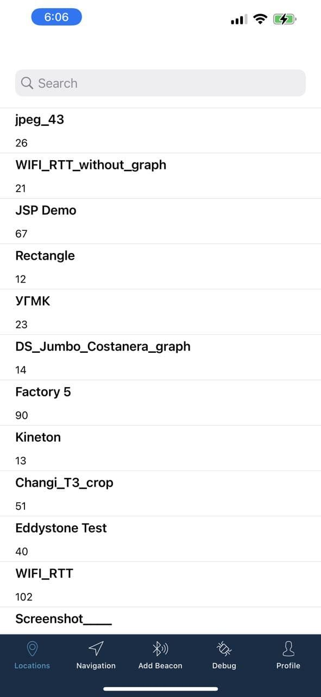
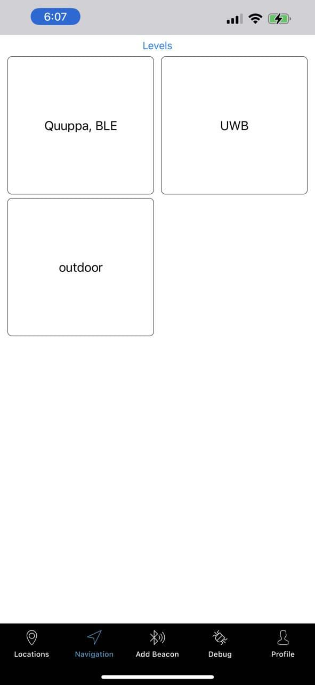
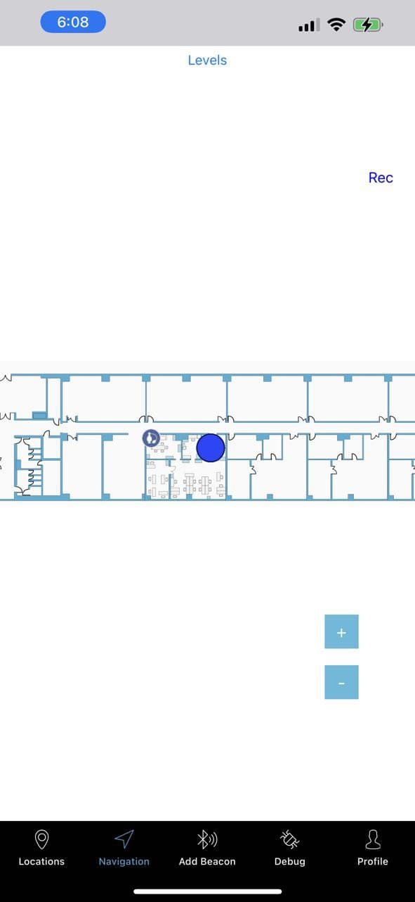
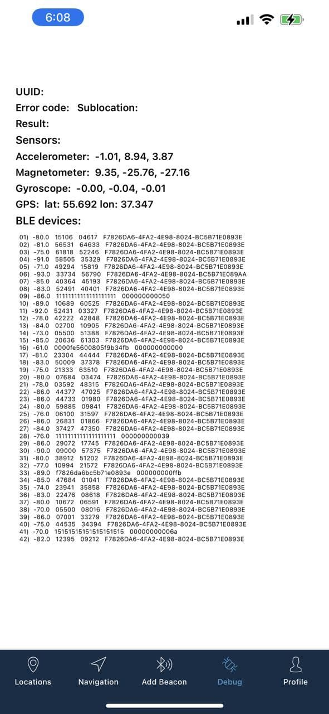

<a href="http://navigine.com"></a>

# iOS SDK 2.0

The following sections describe the contents of the Navigine iOS SDK repository. Files in our public repository for iOS are:

- Sources of the Navigine Demo Application for iOS
- Navigine SDK for iOS - header files and resources

## Useful Links

- [SDK documentation](https://github.com/Navigine/Indoor-Navigation-iOS-Mobile-SDK-2.0/wiki)
- Refer to the [Navigine official documentation](https://docs.navigine.com) for complete list of downloads, useful materials, information about the company, and so on.
- [Get started](http://client.navigine.com/login) with Navigine to get full access to Navigation services, SDKs, and applications.
- Refer to the Navigine [User Manual](http://docs.navigine.com/) for complete product usage guidelines.
- Find company contact information at the official website under <a href="https://navigine.com/contacts/">Contact</a> tab.

## iOS Demo Application

Navigine demo application for iOS enables you to test indoor navigation that you set up using Navigine CMS.
The NavigineDemo subfolder in this repository contains source files that you can use for compiling the Demo application.

To get the Navigine demo application for iOS, 

- Either find the [Navigine application in the Apple Store](https://itunes.apple.com/ru/app/navigine/id972099798) using your iOS device
- Or compile the application yourself [using source code, available at GitHub](https://github.com/Navigine/Indoor-Navigation-iOS-Mobile-SDK-2.0).

For complete guidelines on using the Demo, refer to the [corresponding sections in the Navigine User Manual](https://docs.navigine.com/en/Getting_Started), or refer to the Help file incorporated into the application.

Below, you can see some screenshots of the Demo representing locations list, defined location levels, navigation bar, and debug process.



## Navigation SDK and Implementation

Navigine SDK for iOS applications enables you to develop your own indoor navigation apps using the well-developed methods, classes, and functions created by the Navigine team.
The SDK file resides in the libs folder.

Find formal description of Navigine-SDK API including the list of classes and their public fields and methods at [Navigine SDK wiki](https://github.com/Navigine/Indoor-Navigation-iOS-Mobile-SDK-2.0/wiki).

## Installation with CocoaPods

[CocoaPods](http://cocoapods.org) is a dependency manager for Objective-C, which automates and simplifies the process of using 3rd-party libraries like Navigine in your projects. See the ["Getting Started" guide for more information](https://github.com/Navigine/Indoor-Navigation-iOS-Mobile-SDK-2.0/Getting-Started). You can install it with the following command:

```bash
$ gem install cocoapods
```

> CocoaPods 0.39.0+ is required to build Navigine 2.0.0+.

#### Podfile

To integrate Navigine into your Xcode project using CocoaPods, specify it in your `Podfile`:

```ruby
source 'https://github.com/CocoaPods/Specs.git'
platform :ios, '9.0'

target 'TargetName' do
pod 'Navigine'
end
```

Then, run the following command:

```bash
$ pod install
```
